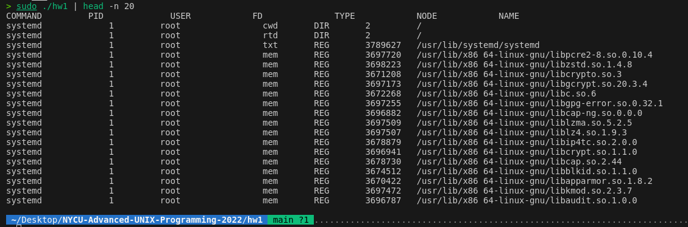

---

# Unix 'lsof' 實作

## Intro
此項目是 Unix 操作系統中 'lsof'（list open files）工具的一個簡易實現，用於列出系統中正在運行的進程打開的文件。此實作能夠提供進程打開的文件描述符的詳細資訊，包括文件名稱、路徑、類型等，類似於傳統的 `lsof` 命令的功能。

## 功能描述
- **無參數運行：** 當不帶任何參數運行時，本程序將列出所有進程的所有打開的文件。
- **參數過濾：**
  - `-c REGEX`：根據進程名稱進行正則表達式過濾。
  - `-t TYPE`：過濾特定類型的文件，如常規文件（REG）、目錄（DIR）、字符設備（CHR）、FIFO、SOCK等。
  - `-f REGEX`：根據文件路徑或名稱進行正則表達式過濾。


## 數據結構 - `struct info`

在本項目中，`struct info` 是一個關鍵的數據結構，用於存儲關於系統進程的詳細資訊。以下是其各個成員的描述：

- **cmd** (`string`): 進程的命令名稱，即在系統中執行的命令或應用程式名。
- **pid** (`string`): 進程的唯一標識符（Process ID）。
- **user** (`string`): 執行該進程的用戶名。
- **fd** (`string`): 文件描述符，標識進程打開的文件或資源。
- **type** (`string`): 打開的文件或資源的類型，如常規文件（REG）、目錄（DIR）或其他。
- **node** (`string`): 文件系統節點號，對於文件系統中的每個文件或資源來說是唯一的。
- **name** (`string`): 與文件描述符相關的完整路徑名或資源名。


## 技術細節
- **程式語言：** C++
- **系統調用與函數：**
  - `opendir`, `readdir`: 用於讀取 `/proc` 目錄下的進程資訊。
  - `readlink`: 用於獲取符號鏈接指向的實際路徑。
  - `stat`, `lstat`: 用於獲取文件或符號鏈接的狀態資訊。
- **資料結構：** 使用 `struct info` 來存儲和處理有關進程的資訊。

## 編譯與運行
1. **編譯指令：**
   ```bash
   make
   //or
   g++ -g -o hw1 hw1.cpp
   ```
2. **運行範例：**
   ```bash
   ./hw1 -c bash
   ./hw1 -t REG
   ./hw1 -f obs
   sudo ./hw1 | head -n 20 
   ```

## Result

